# The Config Crew AI - Manual Técnico Completo

AI-Powered Intelligent Configuration Manager.

## 🎯 Overview
"The Config Crew" es un microservicio especializado que automatiza el merge semántico de configuraciones entre entornos (TEST -> PRE -> PRO). Utiliza **CrewAI** y modelos de lenguaje (LLM) para entender el contexto de los cambios, protegiendo variables críticas de entorno.

## 🏗️ AI Workflow

```mermaid
graph LR
    Req[POST /api/v1/config/merge] --> Init[Load YAML Agents & Tasks]
    Init --> Agent1[Senior Diff Analyzer]
    Agent1 -- "Analyzes TEST Diff" --> Agent2[Environment Specialist]
    Agent2 -- "Semantic Merge to PRE/PRO" --> Agent3[QA Validator]
    Agent3 -- "Syntax & Security Validation" --> Res[Return JSON Result]
```


---

## 🤖 Diseño Agéntico (Deep Dive)

### Sistema Multi-Agente (MAS)
En lugar de un único prompt masivo, utilizamos un proceso secuencial con tres agentes especializados:

1.  **Senior Diff Analyzer**:
    - **Backstory**: Experto en infraestructura y gestión de cambios.
    - **Misión**: Identificar cambios *lógicos* en el contenido, ignorando ruidos o valores temporales.
2.  **Environment Specialist**:
    - **Backstory**: Especialista en DevOps con enfoque en seguridad.
    - **Misión**: Aplicar cambios a PRE y PRO asegurando que **nunca** se sobrescriban secretos, credenciales o hosts de base de datos.
3.  **QA Validator**:
    - **Backstory**: Auditor de configuraciones.
    - **Misión**: Verificar validez sintáctica (YAML/JSON) y cumplimiento de reglas de seguridad.

### Desacoplamiento (YAML-first)
Toda la lógica "cognitiva" (personas de los agentes y descripciones de tareas) reside en `src/config/agents.yaml` y `src/config/tasks.yaml`. Esto permite ajustar el comportamiento de la IA sin modificar el código Python.

---

## 🚀 Especificación de la API
### `POST /api/v1/config/merge`
#### Request Body (JSON)
```json
{
  "ticket_id": "REQ-123",
  "config_test_content": "contenido actual en TEST...",
  "config_pre_current": "contenido actual en PRE...",
  "config_pro_current": "contenido actual en PRO..."
}
```
#### Response Body (JSON)
```json
{
  "status": "success",
  "config_pre_new": "Nuevo contenido PRE generado por la IA",
  "config_pro_new": "Nuevo contenido PRO generado por la IA",
  "reasoning": "Explicación detallada del proceso seguido por los agentes"
}
```

---

## 🛠️ Guía del Desarrollador

### Setup del Entorno
1. **Requisitos**: Python 3.12.12+, Ollama con el modelo `qwen2.5`.
2. **Instalación**:
   ```bash
   python3.12 -m venv venv
   source venv/bin/activate
   pip install -r requirements.txt
   ```

### Configuración (.env)
| Variable | Descripción | Valor Recomendado |
|----------|-------------|-------------------|
| `OPENAI_API_BASE` | Endpoint de Ollama | `http://localhost:11434/v1` |
| `OPENAI_MODEL_NAME` | Modelo local | `qwen2.5` |
| `OPENAI_API_KEY` | Mock key | `ollama` |

### Ejecución y Testing
- **Servidor**: `uvicorn src.main:app --host 0.0.0.0 --port 8000`
- **Tests**: `PYTHONPATH=src pytest tests` (Los tests usan mocks para evitar llamadas reales al LLM).

### Personalización de la IA
Para cambiar cómo se comporta la IA, edita los archivos en `src/config/`. Pydantic v2 validará que la estructura de los agentes sea correcta al instanciarlos.
