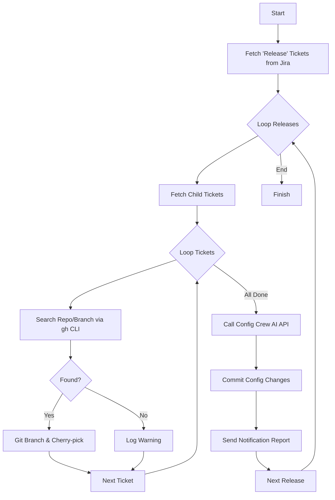

# Orquestador Core - Manual Técnico Completo

Automated Release Orchestration Engine for professional CI/CD pipelines.

## 🎯 Overview
El Orquestador Core es un motor determinista diseñado para automatizar el proceso burocrático de preparación de releases. Sigue los principios de **Clean Architecture** para garantizar mantenibilidad, testabilidad y estándares profesionales (SOLID, KISS).

## 🏗️ Flujo de Orquestación


---

## 🏛️ Arquitectura Detallada (Deep Dive)

### Capas de Responsabilidad
1.  **Capa de Dominio (`src/domain/`)**: El corazón del sistema. Contiene entidades puras (`JiraTicket`, `ReleaseProject`) e interfaces (Ports). No depende de ninguna librería externa.
2.  **Capa de Casos de Uso (`src/domain/use_cases/`)**: Contiene la lógica de negocio central (`PrepareReleaseUseCase`). Orquesta el flujo inyectando las interfaces necesarias.
3.  **Capa de Infraestructura (`src/infra/`)**: Implementaciones concretas (Adapters).
    - **JiraAdapter**: Consultas JQL complejas.
    - **GitHubAdapter**: Wrapper sobre `gh` CLI para aprovechar la autenticación del usuario.
    - **GitAdapter**: Gestión de repositorios locales con `GitPython`.

### Decisiones de Diseño
- **Inversión de Dependencia**: Todos los servicios externos se acceden vía interfaces, permitiendo cambiar GitHub por GitLab o Jira por ADO sin tocar la lógica central.
- **CLI first**: Uso de `Typer` para una interfaz de comandos robusta y documentada.

---

## 📂 Estructura del Proyecto
- `src/domain/entities/`: Modelos de datos (JiraTicket, ReleaseProject, ReleaseReport).
- `src/domain/interfaces/`: Definiciones abstractas de servicios.
- `src/infra/external/`: Adaptadores concretos para Jira, GitHub, Git y SMTP.
- `tests/`: Suite completa de pruebas unitarias y de robustez.

---

## ⚙️ Configuración Exhaustiva (.env)
| Variable | Descripción | Ejemplo |
|----------|-------------|---------|
| `JIRA_URL` | URL base de Jira | `https://company.atlassian.net` |
| `JIRA_EMAIL` | Email de autenticación | `user@company.com` |
| `JIRA_API_TOKEN` | Token de API de Atlassian | `ATATT...` |
| `SMTP_SERVER` | Servidor SMTP para reportes | `smtp.gmail.com` |
| `SMTP_PORT` | Puerto SMTP | `587` |
| `SENDER_EMAIL` | Email de salida | `releases@company.com` |
| `CONFIG_CREW_SOURCE_URL` | Endpoint de la IA | `http://localhost:8000/api/v1/config/merge` |

---

## 🛠️ Guía del Desarrollador

### Instalación y Setup
1. **Requisitos**: Python 3.12.12+, GitHub CLI (`gh`) autenticado.
2. **Entorno**:
   ```bash
   python3.12 -m venv venv
   source venv/bin/activate
   pip install -r requirements.txt
   export PYTHONPATH=src
   ```

### Ejecución
```bash
python src/main.py --status "Ready for PRE"
```

### Protocolo de Testing
Es vital mantener el 100% de éxito en los tests antes de cualquier commit.
- **Ejecutar tests**: `PYTHONPATH=src pytest tests`
- **Cobertura**: Incluye mocks de servicios externos y simulaciones de conflictos de Git (cherry-pick fails).

### Troubleshooting Común
- **`ModuleNotFoundError`**: Asegúrate de que `PYTHONPATH=src` esté configurado. El proyecto utiliza importaciones absolutas.
- **Error en Git**: Verifica que los repositorios locales en `/tmp/release_manager_repos` tengan permisos de escritura.
